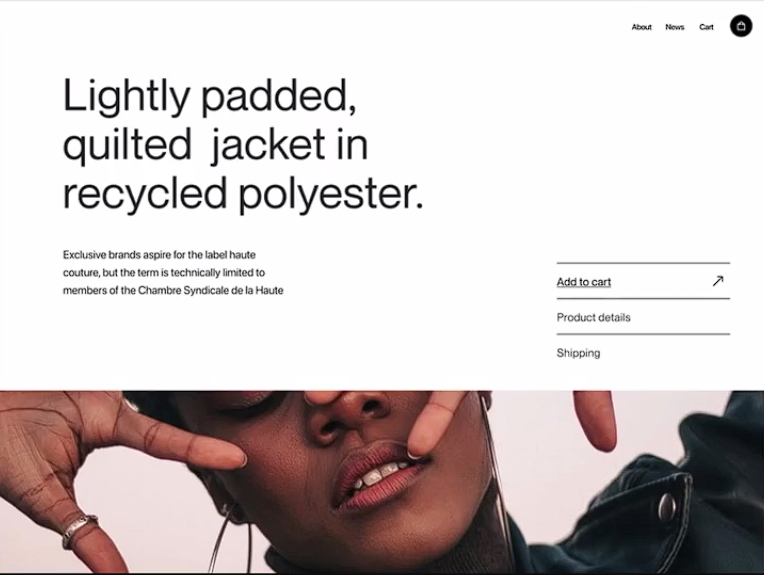

# CSS Project 1 with flexbox

Welcome to **CSS Project 1**! This project is a showcase of various CSS techniques and designs with flexbox. Below, you'll find an overview of the project along with a preview of the final design.



## 🌟 Features

- **Responsive Design**: The layout adapts to different screen sizes, ensuring a seamless experience across devices.
- **Modern UI**: A clean and modern user interface with smooth animations and transitions.
- **Custom CSS**: Utilizes custom CSS properties for an enhanced visual experience.

## 🔧 Technologies Used

- **HTML5**: Markup language for structuring the content.
- **CSS3**: Styling the project with modern techniques with flexbox.


## 📸 Preview

Check out a preview of the project below:


## 🚀 Getting Started

To view the project locally, follow these steps:

1. Clone the repository:
    ```bash
    git clone https://github.com/Adib-programmar/Css-peojecct-1.git
    ```
2. Navigate to the project directory:
    ```bash
    cd Css-peojecct-1
    ```
3. Open the `index.html` file in your browser to view the project.

## 📝 Project Made by
```
Adib Ahnaf Azad
```
---

Feel free to explore and use the code for your own projects. Contributions and suggestions are always welcome!
